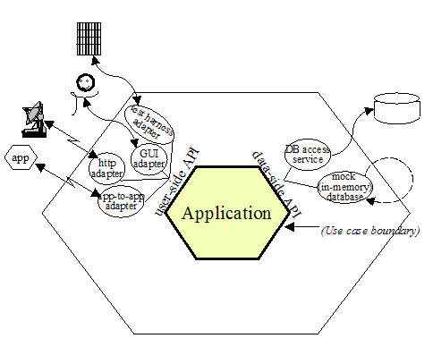
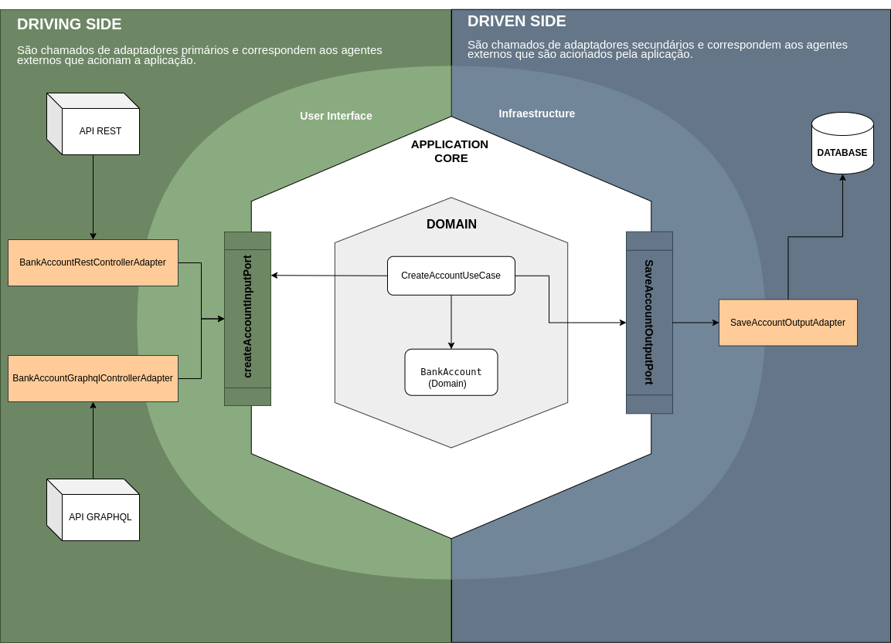

# Spring Hexagonal Architecture

Hexagonal architecture, or ports and adapters architecture, is an architectural pattern used in software design that aims to create loosely coupled application components that can be easily connected to your software environment through ports and adapters.

Fonte: https://alistair.cockburn.us/hexagonal-architecture/

### Technologies used

* [Java](https://www.java.com/en/)
* [Spring](https://spring.io/)
* [MySQL](https://www.mysql.com/)
* [JPA](https://spring.io/projects/spring-data-jpa)

## Dependencies

* Java - Version: 17
* Spring - Version: 3.2.2

## Application description

The application simulates a banking terminal, allowing you to create an account and carry out banking transactions, such as withdrawals, deposits and balance checks.

### Application Architecture

The example below shows how the hexagonal architecture was applied to the project.

### Anatomy of the application

In Adapters (API)
- BankAccountRestControllerAdapter
- BankAccountGraphqlControllerAdapter

Out Adapters (Persistence)
- LoadAccountOutputAdapter
- SaveAccountOutputAdapter

In Port
- CreateAccountInputPort
- DepositAccountInputPort
- WithdrawAccountInputPort
- BalanceAccountInputPort

Out Port
- LoadAccountOutputPort
- SaveAccountOutputPort

Domain
- BankAccount

UseCase
- CreateAccountUseCase
- DepositAccountUseCase
- WithdrawAccountUseCase
- BalanceAccountUseCase
---
Thank you for being part of this learning project and I hope I've helped.
